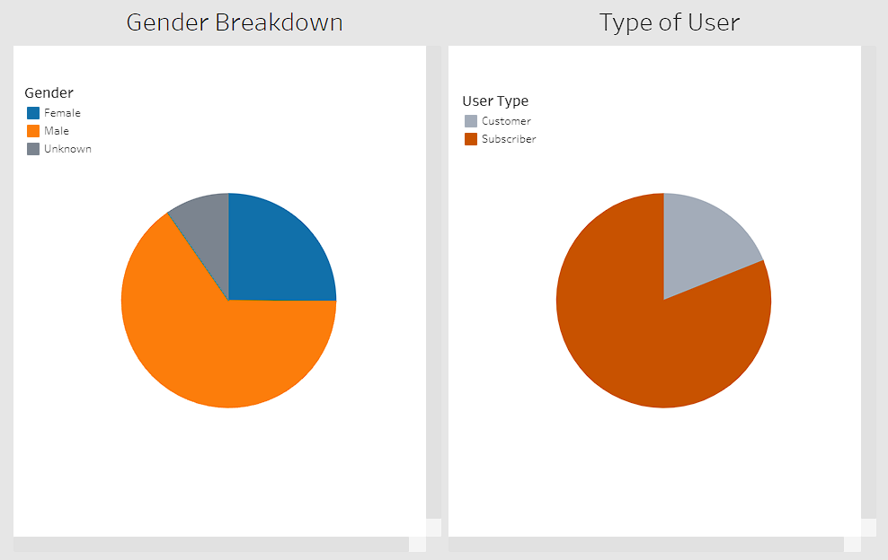
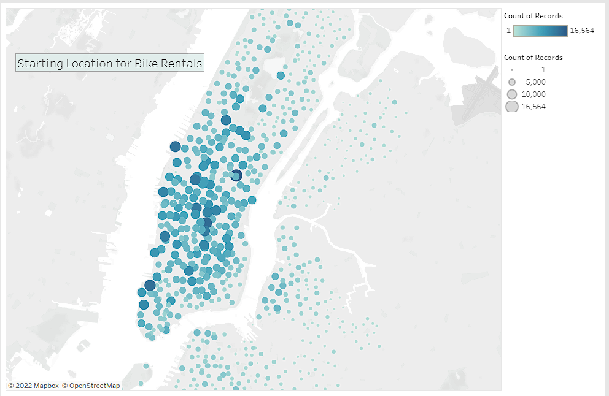
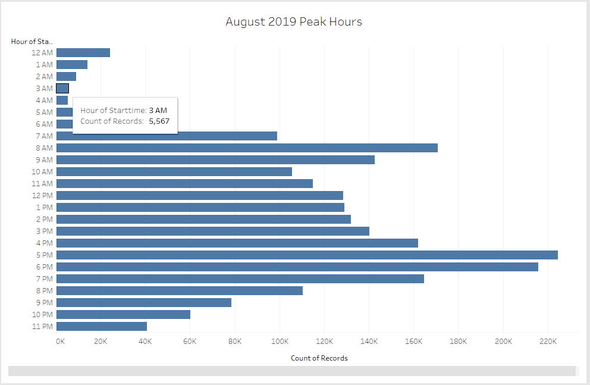
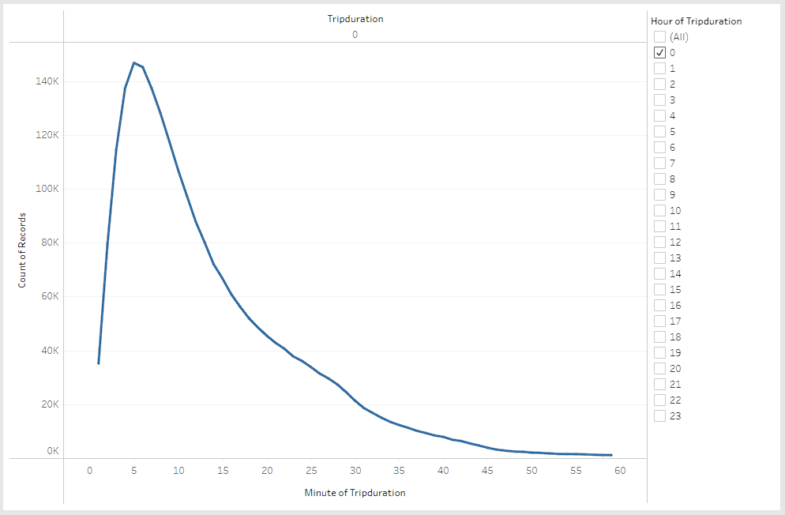
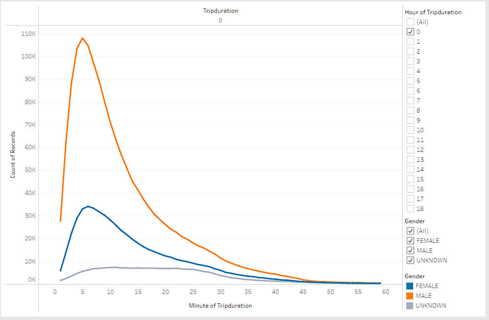
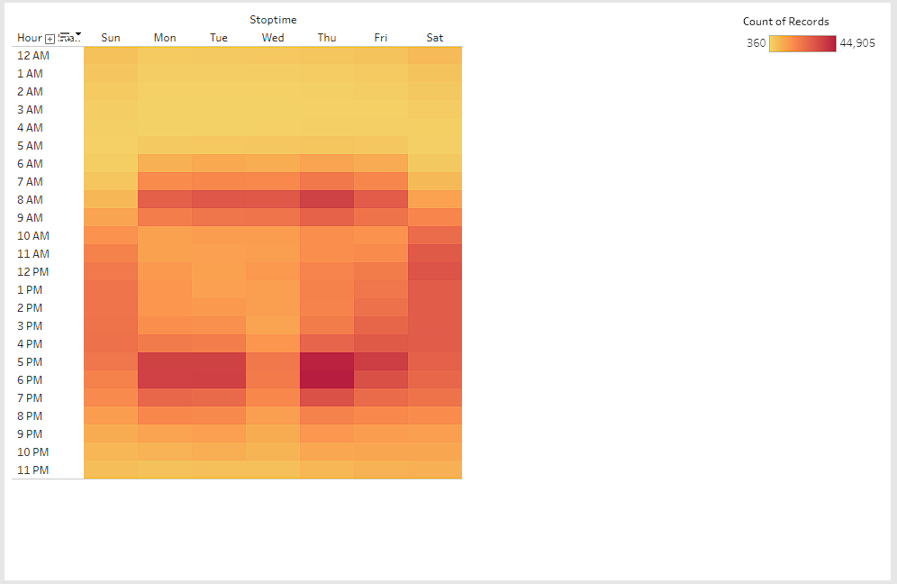
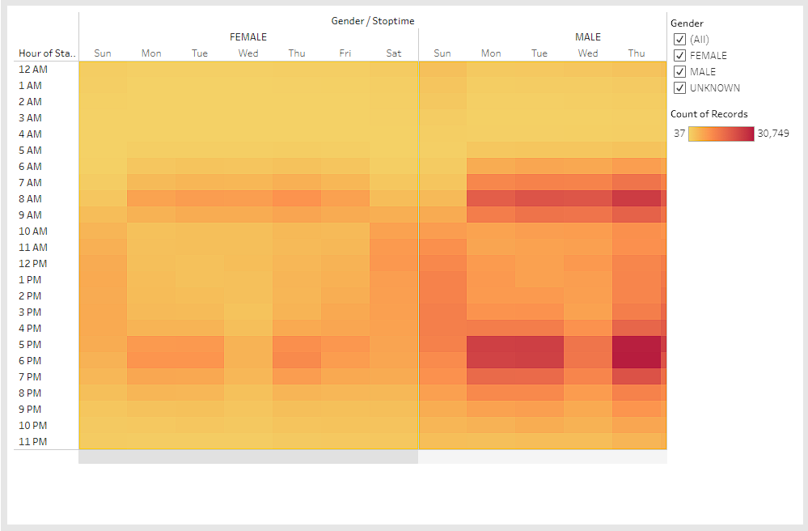

# Bike Sharing
## Overview
The goal of this report is to create a business proposal for a new bikesharing company in Des Moines, Iowa. Using [citibike data](https://s3.amazonaws.com/tripdata/index.html) from New York City in 2019, we will create a presentation using Tableau Public for shareholders. We decided to choose August data as it is a common month for biking. The results section will have descriptions regarding the presentation slides and we will finish with high level summary about how to create a successful bikesharing company in Iowa.

## Resources
Presentation: [NYCity Bike Analysis](https://public.tableau.com/app/profile/aidan.tank/viz/Module14_Challenge_16632658405360/NYCitiBikes)

#### Software:
- Tableau Desktop Public Edition 2022.2.1
- Visual Studio Code 1.71.1
- Jupyter Notebook 6.4.8
- Python 3.7.13
- Anaconda 4.13.0

Data: [201909-citibike-tripdata.csv.zip](https://s3.amazonaws.com/tripdata/index.html)

## Results
Please visit the Presentation link in the resources section to interact with the visualization slides below. This section will show each slide and a description to give the viewer more information.

### 1. Who are our Bikers?

Let's start with exploratory analysis of our data. Who are the bikers in our dataset? Graphed using pie charts, we can visualize our bikers by gender and by user type. A customer refers to a single use user (24-hour pass or 3 day pass), whereas a subscriber is a annual member. About a quarter of our bikers are female and a majority are male. Most of our bikers are annual subscribers. The most common group of New York citibike user is a male annual subscriber.

### 2. Where do they start?

Now that we know who are bikers are, we need to know where they are renting from. The next map shows the starting bike station for bike rentals. The larger the volume of bikers, the darker and larger the circles are. The bulk of the rental starting locations is in Manhattan. Manhattan is also the most densely populated borough of New York City. It seems people prefer to rent bikes here due to the difficulty to travel by car and store their own bikes in their residence.

### 3. When do they travel?

The next question to answer about our bikers is time. We will start about by showing when bikes are rented in a given day. The bar chart above shows how many bikes are rented during each hour interval throughout the day. The least common is from 2am to 5am, whereas the most common is between 5pm and 8pm. People tend to rent bikes during the day. Night time would be the ideal time to repair any bikes or stations.

### 4. How long do they ride?

Another questions of time is who long do bikers rent for? This chart shows the number of bike rentals per time in minutes. You can filter the graph based on hours. It is selected at "0" right now as the majority of our trips last less than one hour. In fact, most of our bike trips last between five and ten minutes! Bikes are mainly being rented to go a short distance.

### 5. Trips by Gender

We can break up the trip duration by gender as well as shown in the above chart. You can filter this chart by gender and hours. Both Male and Female bike riders see the most common bike ride around five minutes, however the drop off after five minute trips is much less severe for females. It seems females tend to have trips that last a little bit longer than males.

### 6. Heatmap by Weekday

We can visualize the bike trips using heatmaps as well. Here we have the time of day the biker started by the weekday the biker ended. The darker the map, the more frequent the trips. Thursdays seem to be the most common time for bike rentals. We can also notice darker areas from 7am to 10am and 4pm to 9pm on weekdays. People tend to rent bikes to get to and from work and it is more common to rent a bike home than it is to go to work. The weekends are more spreadout throughout the day as people are not at work all day. Lastly, we notice Wednesday after work it is much less common to rent a bike. Maybe there is another transportation service that is cheaper on Wednesday's to use? We would have to do more research.

### 7. Heatmap by Gender

To see the whole graph and scroll, please visit the presentation link in the resources section. This is another map you can filter to only look at male or female data. When viewed side by side, male renters vastly outnumber female renters with Thursday's still the most common. However, when looking solely at female renters, we see a larger portion of rentals on Saturday than males. Females tend to rent bike on weekends at a higher proporation than males.

### 8. Heatmap by User Type

Our final filterable heat map looks at user type. We already know the majority of our renters are male annual subscribers. When filtering for just that field we still see Thursday as the most common day to rent and Sunday being the least common. Female subscribers see both Sunday and Wednesday as the least common days to rent, with Thursday still being the most common. On the other hand, customers rent bike most commonly on weekends. Renters who choose one or three day passes use them on weekends, not during the week. Thus, annual subscribers use rental bikes for work whereas one/three day pass renters use it to get around the city during the weekend.

## Summary
To recap, our most common bike renter is a male annual subscriber. They mainly take trips between five and ten minutes in Manhattan. These annual subscribers are renting bikes to get to and from work. Other forms of transit are slower in densely populated areas like Manhattan and due to tight living spaces, they cannot get their own bikes. Customers for one/three day passes tend to rent bikes during the weekends to get around the tight and compact city easier. In order to appeal to a similar crowd in Des Moines, Iowa, bike rental stations should be set up near the most populated part of the city near business and apartments.

### Additional Visuals
The visuals above could never capture the entire picture of citibike rentals in New York City. Below are a couple of ideas for additional visualizations for the August 2019 dataset:

1. Utilize the birthyear variable to create a bar chart of birthyear and count of records. This way we can see the distribution of records by birthyear to better help understand which age group is renting citibikes the most.

2. Further using the birthyear variable, we can create a new variable for people under/over thirty years old. Then we can plot a heatmap based on trips like we did for slides 6 through 8 on our analysis to see if behavior of renters differs pre and post thirty.